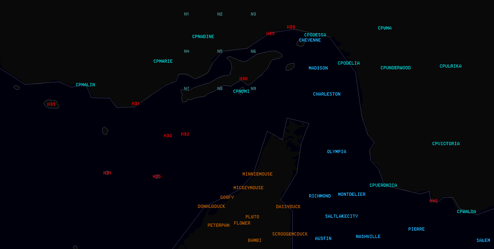

# JSON LotATC Overlays

RIGHT CLICK / SAVE AS. (OR COPY PASTE YOUR OWN)

####  [CONTACT POINTS IRAN EAST](/JSON/CP_IRAN_EAST.json)
####  [CONTACT POINTS IRAN WEST](/JSON/CP_IRAN_WEST.json)
####  [IAF NOLSO 312FLIP](/JSON/IAF_NOLSO_312FLIP.json)
####  [IRAN AIRFIELD HOTEL DESIGNATION](/JSON/IRANIAN_AIRFIELD_HOTEL_DESIGNATION.json)
####  [IRAN AIRFIELD NAMES](/JSON/IRANIAN_AIRFIELD_NAMES.json)
####  [LAND OUTLINE](/JSON/LAND_OUTLINE.json)
####  [NAVP OPUF UAE_interior](/JSON/NAVP_OPUF_UAE_interior.json)
####  [NAVP OPUF WEST WET](/JSON/NAVP_OPUF_west_wet.json)
####  [NAVP OPUF EAST WET](/JSON/NVAP_OPUF_east_wet.json)  

### KILLBOXES

### IFF Codes
####  [IFF Codes JSON](/JSON/transponder_codes.json)

### NAVPOINTS 

All navigation points and information about airspace, threatsites, JTAC locations, FARPs, tankers, please refer to OP URGENT FURY Combat Flite for current version:
 
[OPUF Combat Flite Masterfile FLITE](/OPUF-Brief/OPUF_Masterfile.cf)

 
 
 
 
 
## Back
[Back to frontpage](https://132nd-vwing.github.io/OPUF-Brief/) 
